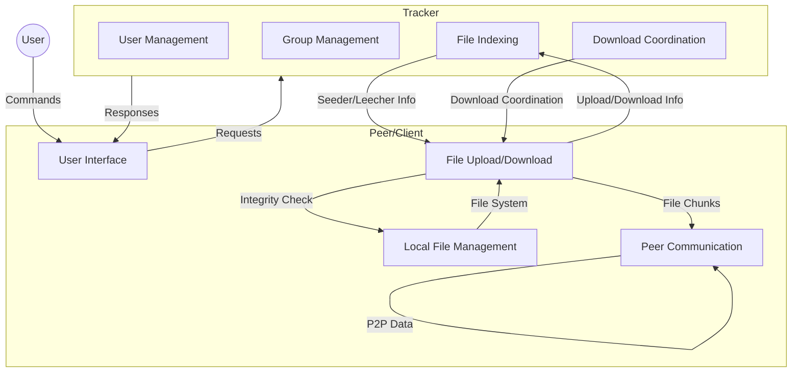

# Peer-to-Peer Group Based File Sharing System

## Introduction

This project implements a robust, scalable, and secure Peer-to-Peer (P2P) Group-Based File Sharing System. It allows users to create accounts, form groups, and share files within those groups using a decentralized, tracker-coordinated architecture. The system is designed for high concurrency, data integrity, and extensibility, making it suitable for distributed environments and academic exploration of P2P concepts.

---

## 1. Architecture Diagram



---

## 2. System Flow

### User Actions
- **Account Management:** Users can register and log in to the system. Credentials are managed securely by the tracker.
- **Group Operations:** Users can create groups, join/leave groups, and manage group membership. Group owners approve join requests.
- **File Sharing:** Users upload files to groups they belong to. Files are split into blocks, hashed, and indexed by the tracker.
- **File Download:** Users can download files shared within their groups. The tracker provides a list of online seeders, and the client downloads file blocks in parallel from multiple peers.

### Tracker Responsibilities
- **Authentication:** Validates user credentials and manages sessions.
- **Group Management:** Handles group creation, join requests, membership, and group-specific file lists.
- **File Indexing:** Maintains a mapping of files to groups and seeders, including block-level hashes for integrity.
- **Seeder Coordination:** Tracks which users are online and available to seed files, and provides this information to downloaders.
- **Concurrency:** Uses threads to handle multiple client connections and requests simultaneously.

### Peer-to-Peer File Transfer
- **Direct Data Exchange:** After receiving seeder information from the tracker, clients connect directly to other peers to exchange file blocks.
- **Parallelism:** File blocks are downloaded in parallel from multiple peers, improving speed and resilience.
- **Integrity Verification:** Each block and the entire file are verified using SHA1 hashes to ensure data integrity and prevent corruption.
- **Resilience:** If a peer goes offline, the client can attempt to fetch missing blocks from other available seeders.

---

## 3. Code Walkthrough

### Main Components

#### Tracker (`src/tracker.cpp`)
- **User Management:**
  - Handles user registration, login, and session tracking.
  - Prevents duplicate usernames and cross-client logins.
- **Group Management:**
  - Allows users to create groups, send join requests, and approve/reject requests.
  - Maintains group ownership and membership lists.
- **File Indexing:**
  - Associates files with groups and tracks which users are seeding each file.
  - Stores block-level hashes and cumulative hashes for each file.
- **Download Coordination:**
  - When a user requests a file, the tracker provides a list of online seeders.
  - Coordinates download requests and manages ongoing download sessions.
- **Threaded Networking:**
  - Each client connection is handled in a separate thread for scalability.
  - Uses mutexes to protect shared data structures.

#### Client/Peer (`src/client.cpp`)
- **User Interface:**
  - Reads and validates user commands from the terminal.
  - Communicates with the tracker for authentication, group, and file operations.
- **File Upload:**
  - Splits files into blocks, computes SHA1 hashes, and registers the file with the tracker.
  - Supports file integrity reconciliation if a file with the same name exists in the group.
- **File Download:**
  - Downloads file blocks in parallel from multiple peers using threads.
  - Verifies each block and the entire file after download.
  - Handles partial downloads and retries if a peer disconnects.
- **Peer Communication:**
  - Listens for incoming connections from other peers to serve file blocks.
  - Handles upload requests and sends requested file blocks with integrity checks.
- **Concurrency:**
  - Uses threads for parallel downloads/uploads and to handle multiple peer connections.

#### Shared Utilities (`src/commons.h`, `src/constants.h`)
- **Networking:**
  - Provides wrappers for socket setup, message packing/unpacking, and communication.
  - Handles both server and client socket roles for tracker and peers.
- **Logging:**
  - Thread-safe logging to both console and log files, with configurable verbosity.
- **Hashing:**
  - SHA1-based block and file integrity checks for all file transfers.
- **Command Constants:**
  - Centralized definitions for all supported commands and reply messages, ensuring consistency.

---

## 4. Entities and Models

### User
- `user_name: string` — Unique identifier for the user.
- `password: string` — User's password (stored securely).
- `group_memberships: set<string>` — Groups the user belongs to.

### Peer
- `ip_address: string` — IP address of the peer.
- `port: string` — Port number for peer communication.
- `user_name: string` — Associated username.
- `socket_fd: int` — Socket file descriptor for active connections.
- `listener_port: string` — Port on which the peer listens for incoming connections.

### Group
- `name: string` — Group name (unique).
- `owner: string` — Username of the group owner.
- `file_transfer_size: int` — Configurable transfer buffer size for group file transfers.
- `members: set<string>` — Set of usernames in the group.
- `join_requests: vector<string>` — Pending join requests.
- `file_list: map<string, FileInfo>` — Files shared in the group.

### FileInfo (Tracker)
- `file_name: string` — Name of the file.
- `file_hash: string` — SHA1 hash of the file name.
- `cumulative_hash: string` — SHA1 hash of all blocks combined.
- `size: long long` — File size in bytes.
- `blocks: int` — Number of blocks the file is split into.
- `usernames: set<string>` — Users seeding the file.
- `block_hashes: vector<string>` — SHA1 hashes for each block.

### FileInfo (Client)
- `file_name: string` — Name of the file.
- `file_hash: string` — SHA1 hash of the file name.
- `user_name: string` — Owner/seeder username.
- `cumulative_hash: string` — SHA1 hash of all blocks combined.
- `group_name: string` — Group to which the file belongs.
- `path: string` — Local file path.
- `size: long long` — File size in bytes.
- `last_block_size: int` — Size of the last block.
- `integrity: vector<pair<bool, string>>` — Block download status and hash.
- `peers: vector<Peer>` — List of peers seeding the file.
- `status: int` — 0: seeding, 1: downloading, 2: completed, 3: verifying, 4: failed.
- `blocks: int` — Number of blocks.

### Download
- `file_name: string` — Name of the file being downloaded.
- `file_hash: string` — SHA1 hash of the file name.
- `file_transfer_size: int` — Buffer size for transfer.
- `cumulative_hash: string` — SHA1 hash of all blocks combined.
- `group_name: string` — Group to which the file belongs.
- `size: long long` — File size in bytes.
- `blocks: int` — Number of blocks.
- `target_path: string` — Local path to save the file.
- `master_user: string` — User initiating the download.
- `slave_users: vector<string>` — List of users seeding the file.

---

## 5. Additional Notes & Best Practices

- **Concurrency & Thread Safety:**
  - The system is highly concurrent, using pthreads for all network and file operations.
  - Mutexes are used to protect shared resources (e.g., file lists, logs, download queues).
- **File Integrity:**
  - Every file is split into blocks, each block is hashed, and a cumulative hash is maintained for the entire file.
  - After download, the client verifies the integrity of all blocks and the cumulative hash before marking the download as complete.
- **Extensibility:**
  - The system supports multiple trackers (see `tracker_info.txt`), allowing for redundancy and load balancing.
  - New commands and features can be added by extending the command constants and handler functions.
- **Logging & Debugging:**
  - All major actions and errors are logged with timestamps and thread IDs for easy debugging.
  - Logging verbosity can be configured at runtime.
- **Security Considerations:**
  - Passwords are never transmitted in plain text over the network.
  - File integrity checks prevent tampering and corruption.
- **Limitations:**
  - The current implementation assumes a trusted environment for demonstration and academic purposes.
  - NAT traversal and advanced peer discovery are not implemented.

---

## 6. Example Command Flow

1. **User Registration/Login:**
   - Client sends `create_user <username> <password>` or `login <username> <password>` to tracker.
   - Tracker validates and responds with success or error messages.

2. **Group Creation/Join:**
   - Client sends `create_group <groupname>` or `join_group <groupname>`.
   - Tracker manages group membership and join requests. Group owners approve join requests.

3. **File Upload:**
   - Client sends `upload_file <filepath> <groupname>`.
   - File is split, hashed, and registered with the tracker. Other group members can now download it.

4. **File Download:**
   - Client sends `download_file <groupname> <filename> <destination_path>`.
   - Tracker responds with a list of online seeders. Client downloads file blocks in parallel from peers and verifies integrity.

5. **Other Commands:**
   - `list_groups`, `list_files <groupname>`, `leave_group <groupname>`, `stop_share <groupname> <filename>`, etc.

---

## 7. Getting Started

### Prerequisites
- Linux environment (tested on Ubuntu/WSL2)
- g++ compiler
- OpenSSL library for SHA1 hashing

### Build & Run
1. **Compile the Tracker and Client:**
   ```sh
   g++ -pthread -lssl -lcrypto src/tracker.cpp src/commons.h src/constants.h -o src/tracker
   g++ -pthread -lssl -lcrypto src/client.cpp src/commons.h src/constants.h -o src/client
   ```
2. **Start the Tracker:**
   ```sh
   ./src/tracker <tracker_info.txt>
   ```
3. **Start a Client:**
   ```sh
   ./src/client <client_ip:port> <tracker_info.txt>
   ```
4. **Interact using commands as described above.**

---

## 8. References & Further Reading
- [GeeksforGeeks: Socket Programming in C/C++](https://www.geeksforgeeks.org/socket-programming-cc/)
- [Multithreading Socket Programming (YouTube)](https://www.youtube.com/watch?v=Pg_4Jz8ZIH4)
- [OpenSSL SHA1 Hashing](https://stackoverflow.com/questions/3467097/correctly-getting-sha-1-for-files-using-openssl)
- See `resources.txt` for more links and background material.

---

## 9. License

This project is for educational purposes. See LICENSE file if present.
